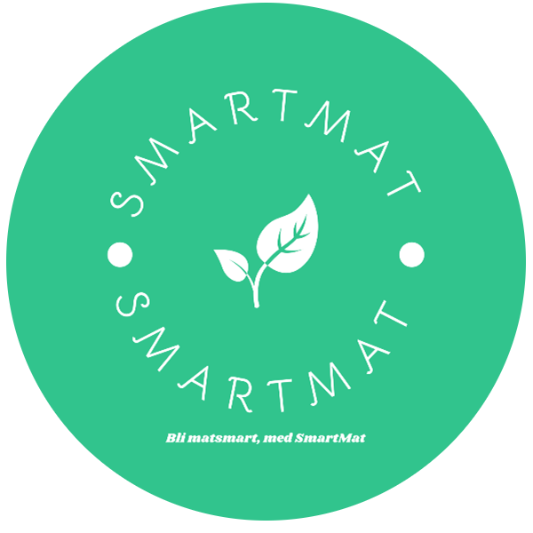

# SmartMat
To visit SmartMat, please follow the link:

https://smartmat.app/

## Name
`SmartMat`

Is the application name according to the task description.

## Logo

## What is SmartMat?
SmartMat is an app for people sharing a fridge. The app lets users manage and supervise the status of products stored in the fridge. The goal of SmartMat is to reduce food waste, and serve as a fun and easy way to communicate the state of a fridge. The app is designed with user experiennce in focus.

## Project Setup for Developers

1. Clone SmartMat using: 

#### For SSH:
    `git clone git@gitlab.stud.idi.ntnu.no:idatt2106-v23-03/frontend.git`

#### For HTTPS:
    `git clone https://gitlab.stud.idi.ntnu.no/idatt2106-v23-03/frontend.git`
    
2. Change directory:

    `cd frontend/SmartMat`

3. Install dependencies etc.

    `npm install`

4. Run as developer on localhost:

    `npm run dev`

Further information, see: https://docs.gitlab.com/ee/gitlab-basics/start-using-git.html

## Continuous Integration

SmartMat uses the built-in continuous integration in GitLab.

### CICD-Pipeline

To utilize GitLab features, the project is set up with continuous integration and continuous deployment for the front-end. The script is found in the project's '.gitlab-ci.yml' file in the project directory. 

As an overview, there are five essential stages the pipeline executes:

  - install 
     - installs dependencies
  - build
    - builds the app for distribution
  - test
    - runs vitest unit tests
    - generates test report artifact `clean_test_output.txt` file
  - security
    - runs OWASP-dependency check report
    - returns artifact: `owasp_dependency_report.json` file
  - (deploy) 
    - deploys the built app to GitHub Pages
    - this stage is only applied to merges or commits to the 'Deploy'-branch

#### Building the project for production
To test that the project builds correctly, the application is bundled with Vite.

To run the build  script command, type: 

    `npm run build`

#### Unit Testing
The unit testing framework used for development is Vitest. To ensure that any new edits is coherent with the application code standards.

To run the tests, type:

    `npm run test:unit`

#### E2E Testing 
To ensure that the application's user stories are fulfilled, the development of SmartMat has relied on Cypress end-to-end integration testing. 

First change directory into SmartMat:

    `cd frontend/SmartMat`

Then, open a terminal, and serve the local app using:

    `npm run dev`

Then, to access the cypress e2e-tests, enter the following in a new terminal:

    `npm run cypress:dev`

or manually using:

    `npx cypress open --e2e`

## Design

#### Color Palette

[Link to palett](https://coolors.co/31c48d-7fdab8-fdfefe-333333-328165)
